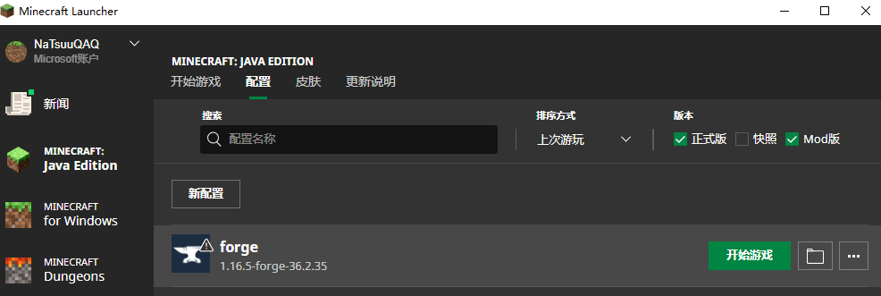

## BJTU GN Craft

**到达世界最高城理塘~**

# 什么是BJTU GN Craft
GN Craft顾名思义就是百胶带的郭楠玩的Minecraft！不是郭楠不准玩（？）当前服务器运行的版本为1.16.5，部署在石家庄地区的阿里云（主要是因为最便宜）。

# 如何玩GN Craft

首先要有一个java环境不用多说了吧，推荐 `java8` 运行起来比较稳定。

## 从哪里获得mods

在群文件里（省点服务器带宽钱吧5555），为了方便，服务器的mod采用增量更新的方式。名为 `GNMCv1.x.zip` 或 `GNCraftv1.x.zip` 的为某一版本添加的mod（里面会附带一个changelog），名为 `GNCraftFullv1.x.zip` 的是某一版本的全量mod包（如果没有就是我还没传捏）。

## 正版用户
对于正版用户，请前往[minecraft forge](https://files.minecraftforge.net/net/minecraftforge/forge/index_1.16.5.html)官方网站下载对应1.16.5的forge（如36.2.35）版本，选择installer，你会得到一个jar文件。双击点开（如果点不开说明没有java捏）默认就是**install client**并且选择的是正版minecraft的所在位置（即 **%APPDATA% /.minecraft** ），安装即可。

然后打开Minecraft Launcher，应该会多出如图所示的一个minecraft版本。

点击文件夹图标就可以打开.minecraft文件夹（或者 `Win+R` 然后 `%APPDATA%/.minecraft`），如果该目录下没有一个叫做 `mods` 的文件夹，那么就自己创一个（狠狠地创！），然后把mod都放进去就可以惹！

> **或许你需要：** 在Minecraft Launcher的forge版本右边更多->编辑->显示更多选项，在 **JVM参数** 那里将 `Xmx2G` 的2变大一些，给JVM虚拟机多分配点内存，不然启动的时候会卡爆。

## 没有正版如何玩GN Craft

下载启动器[HMCL](https://hmcl.huangyuhui.net/)，该启动器运行需要用javafx库，因此只支持到java8。把它放到一个单独的文件夹（因为它会在同级目录创建`.minecraft`文件夹来管理），打开后新建一个用户名（**最好不要带中文符号**），创建一个版本为1.16.5的游戏，勾选上forge和optfine。它会在国内镜像源把游戏下载好，然后点左边的版本、上面的模组管理，把mod添加进去（或者在文件夹里直接拖就行）。

> **或许你也需要：** 多分配点内存捏

## 服务器地址

8.142.146.173:25565

# GN Craft都有什么mod
- 匠魂及其附属，好玩捏
- 工业先锋，好玩捏
- 暮色森林，好玩捏
- 魔法农业及其附属，好玩捏
- 拔刀剑及其附属，好玩捏
- 总之就是好玩捏

# 服务器开支

租了一个 `2核3.1GHz` CPU、`8G` 内存、带宽按流量计费峰值 `25Mbps` 的阿里云。CPU每月一口价 `200` 元，带宽三天用了 `20` 元。这个带宽其实也能接受，10MBps包月就要470大洋惹，目前玩的人不多，后续如果玩的人多了再评估。（如果有大佬了解更便宜的方案请联系我）

## 所以

如果大佬们愿意给大饼打赏点分担一下服务器开支就太好了！

大饼支付宝账号 `natsuux@foxmail.com` 先提前给老板们磕头了！收支将会公开捏

**v我20喝瑞幸咖啡！让我和谷神更接近一点😭**

---

# Changelog
v1.3
+ `CodeChickenLib` 区块加载器的lib
+ `ChickenChunks` 区块加载器
+ `Yamazakura` 拔刀剑附属
+ `ex_blades` 拔刀剑附属
+ `Cucmber` 加了一些作物
+ `Mystical Agriculture` 神秘农业，看上去很厉害
+ `Mystical Agradditions` 神秘农业附属包，与匠魂联动
- `inventory sorter` 如果出现"mod channel mismatch"，尝试删除这个mod
本地测试给4G可以顺利运行

=============

v1.2
增量更新捏
+ `lotr` Load of The Ring 大型mod
+ `lotrqome` Load of The Ring 扩展 好像加了地图
+ `jeilotr` LOTR的jei辅助
+ `NaturesCompass` 生物群系指南针，小mod
+ `Inventory Hud` 辅助mod 使用方法见 [这里](https://www.curseforge.com/minecraft/mc-mods/inventory-hud-forge)

=============

v1.1
+ `appleskin` 辅助mod，显示更多食物属性
+ `Bookshelf` 依赖包mod
+ `industrial-foregoing` 工业mod
+ `inventorysorter` 一键整理背包，默认快捷键滚轮
* `jei` 更改为官方发布的版本，！请自行把原来的jei删除（文件名带了个网站那个）！
+ `just enough resources` jei扩展包 显示矿物来源
+ `mantle` 匠魂mod依赖包
+ `mouse tweaks` 背包鼠标操作增强（如按住shift+左键）
+ `pipez` 管道mod
+ `TConstruct` 匠魂mod
+ `titanium` 工业mod依赖包

为了避免mod包过大 没有附带暮色森林mod